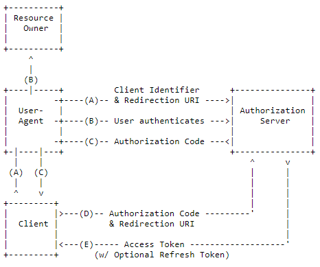
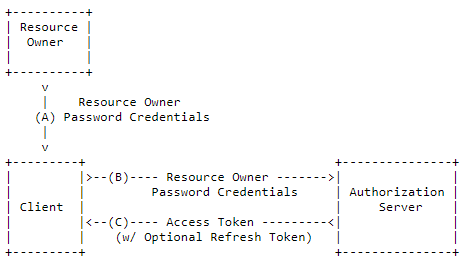

# please-open.it

* Keycloak as a service provider
* oauth2/openid connect consulting

*you don't need to be an oauth2 expert*

---

# Me ?

* Mathieu PASSENAUD (@mathieupassenau)
* Years of experience in authentication (oauth2, JWT, certs, LDAP...)

---

## Tokens

--

### Access Token
Your session id

(sometimes a JWT token)

Send it in a header or a body

--

### ID Token
JWT Token containing claims for your app

(only with "openid" scope, so openid connect)

keep it in your app

--

### Refresh Token
Renew the session without credentials

only for auth server

---

## client
 == your application

--

#### public

*Clients incapable of maintaining the confidentiality of their credentials (e.g., clients executing on the device used by the resource owner, such as an installed native application or a web browser-based application), and incapable of secure client authentication via any other means.*

Web app, mobile app, desktop app... what you install on user device

--

#### confidential

*Clients capable of maintaining the confidentiality of their credentials (e.g., client implemented on a secure server with restricted access to the client credentials), or capable of secure client authentication using other means.*

--

#### Bearer only

Keycloak only : can not instanciate a connection.

---

## Flows

--

#### Authorization code




--

#### Password Grant



```
$postParams = @{client_id='ssh';client_secret='8d012a0a-39aa-4ea5-97b2-133fc0236057';grant_type='password';username='user1';password='user'}
Invoke-WebRequest -Uri https://app.please-open.it/auth/realms/122aa842-0cf0-48e6-a5bc-cca00254a9bb/protocol/openid-connect/token -Method POST -Body $postParams
```

